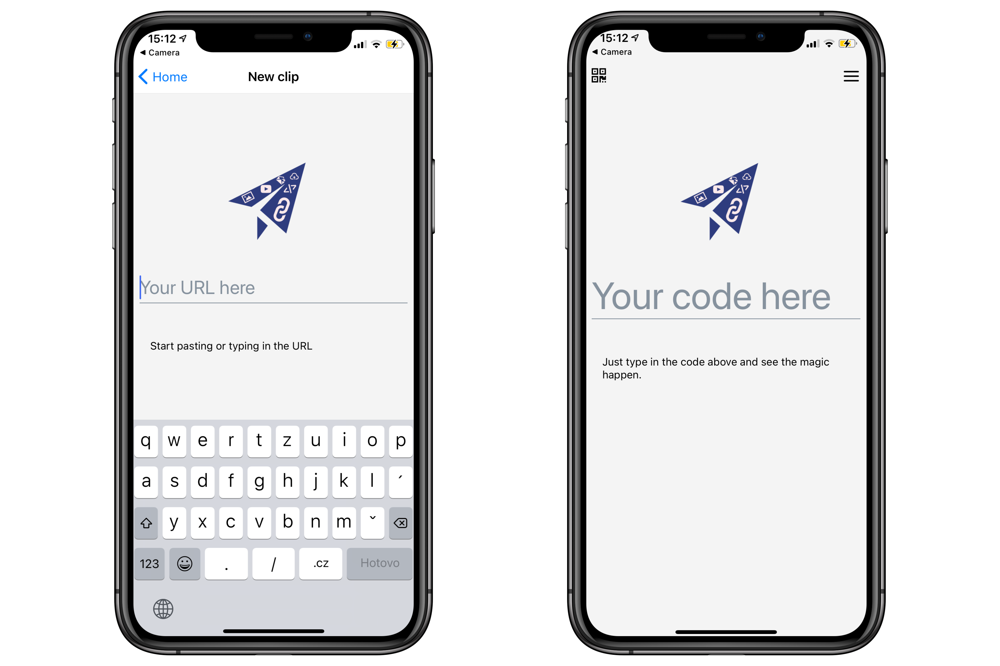

# Iclip mobile

An Interclip app for your phone and stuff

## Prerequisites

- Yarn
- Node.js >= v12.0

## Setup locally

1.  Instal the Expo CLI with `npm i -g expo-cli`
2.  Install dependencies with `yarn`
3.  To start the Expo server, run `yarn start`

## Build the app

- For building for iOS and iPadOS, run `yarn build:ios`
- For building for Android, run `yarn build:android`

## Downloads

- [Android (`.aab` direct link)](https://github.com/filiptronicek/iclip-mobile/releases/latest/download/iclip.aab)
- [iOS (Testflight)](https://testflight.apple.com/join/g9WUiQpm)

## Attribution

Google Play and the Google Play logo are trademarks of Google LLC.
